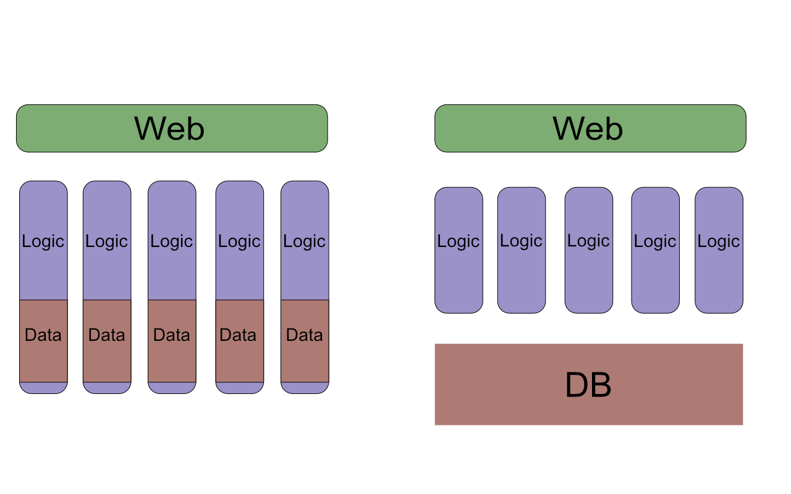
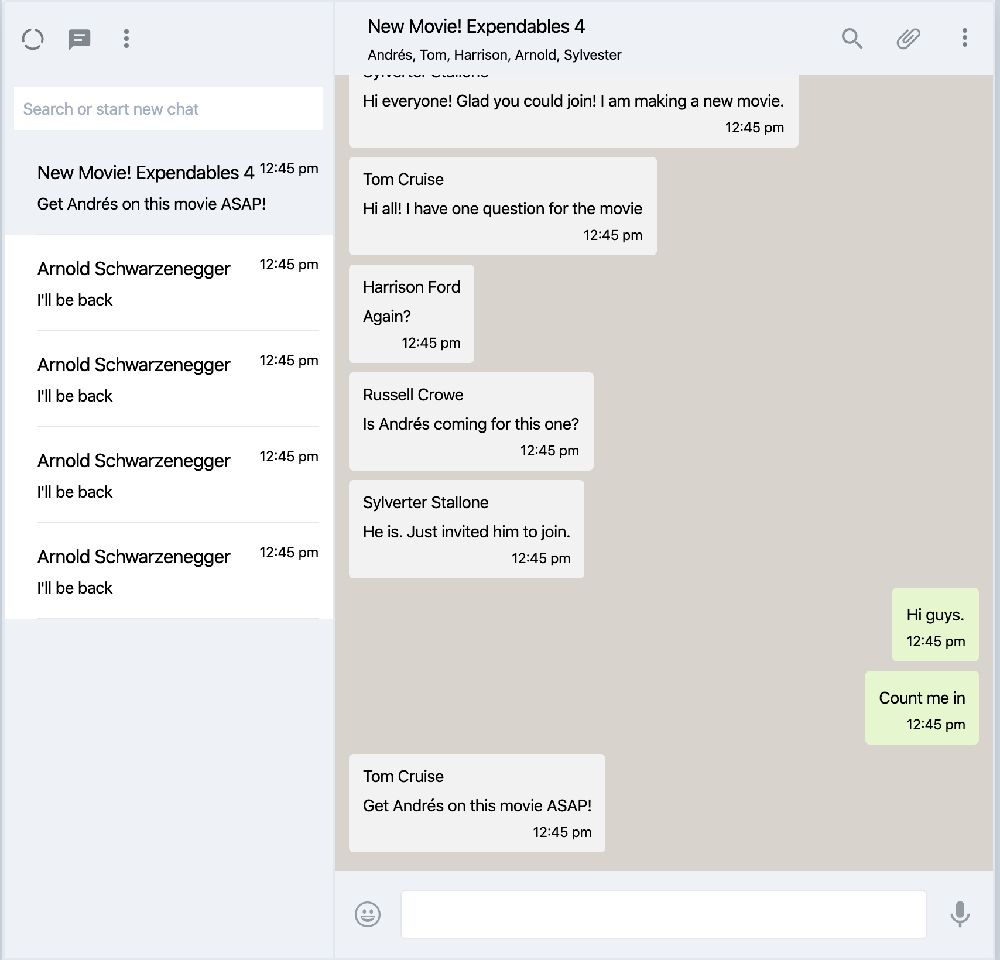

footer: Mickey Chen
slidenumbers: true

# Context
# Endpoint
# Ecto (不確定時間夠不夠)

^ Skip Controller -> Simple, Experienced

---

### https://github.com/aMickeyChen/jibber

---

## Context 是什麼？

---

## Context 是什麼？

> BoundedContext. Bounded **Context** is a central pattern in **Domain-Driven Design**. It is the focus of DDD's strategic design section which is all about dealing with large models and teams. DDD deals with large models by **dividing them into different Bounded Contexts** and being **explicit about their interrelationships**.
-- Martin Fowler

---

---

### Summary

- 把商業邏輯分切
- 明確規範邏輯間的互動

---

### Summary

- 把商業邏輯分切
- 明確規範邏輯間的互動
- **Circumstance over Convention**

^
沒有明確規範，每個團隊自己需要定義
eg. Frontend Split by filetypes vs React Components, Rails' Fat Model

---

### Self Containing Context VS DB Context

^ DB 細節會在 Ecto 講
https://stackoverflow.com/questions/173726/when-and-why-are-database-joins-expensive

---

## 一個聊天服務（大概）該有什麼功能？
# 🤔

---

- 大廳 (公開頻道)
- 多人聊天室
- 跨聊天室推播
- 使用者CRUD
- Chat Filtering
- 回覆訊息 (line messenger like)
- Emoji Reaction

---

## 這個服務的 Context 包含：

---

- user -> Account
- Chat
  - Room
  - Reply
  - Message Filtering
- Reactions

---

## 幫你的聊天服務開好 Context 吧

^ 未來會講更多 Context 的好處

---

# 聊天服務的 UI

---

# Phoenix Router

---

### Phoenix Router is RESTful

- pipeline and pipethrough
- scopes
- resources
  - 7 actions: index, show, delete, new, create, edit, update
  - can be nested

^ keep to the 7 verbs

---

## 加 Post Message 功能到聊天服務吧

^ hands-on

---

# Ecto

https://infinite-red.slides.com/infinitered/ecto-part-2#/
